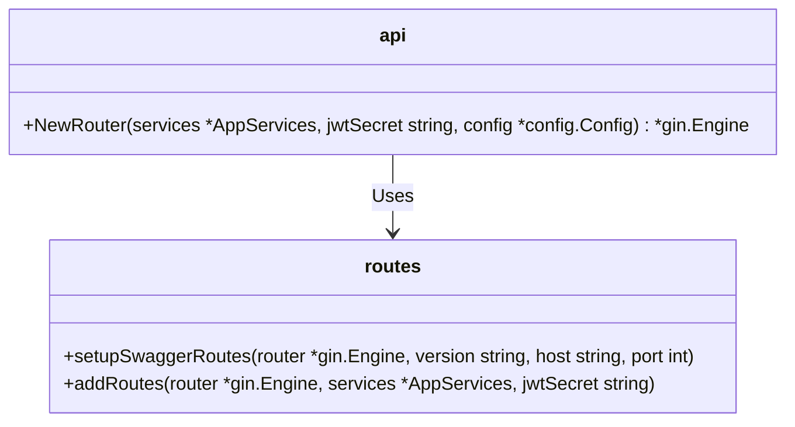

# [router.go](router.go)

Package `api` implements the REST API router and routes for the ChatLogger API.

This file sets up the Gin router with middleware, route groups, and injects dependencies for handlers.



```go titlle="router.go"
package api

import (
    "github.com/gin-gonic/gin"
    "github.com/kjanat/chatlogger-api-go/internal/config"
    "github.com/kjanat/chatlogger-api-go/internal/middleware"
    "github.com/kjanat/chatlogger-api-go/internal/version"
)

// NewRouter sets up the Gin router with defined routes.
func NewRouter(services *AppServices, jwtSecret string, config *config.Config) *gin.Engine {
    router := gin.Default()

    // Apply global middlewares
    router.Use(middleware.VersionHeader())

    // Set up API documentation routes
    setupSwaggerRoutes(router, version.Version, config.ServerHost, config.ServerPort)

    // Add API routes
    addRoutes(router, services, jwtSecret)

    return router
}
```
