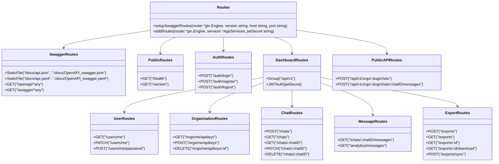

# [routes.go](routes.go)

Package `api` implements the REST API `router` and `routes` for the ChatLogger API.

This file defines the route setup for different API endpoints, including public
routes for chat plugins, authenticated routes for dashboard users, and admin routes.

