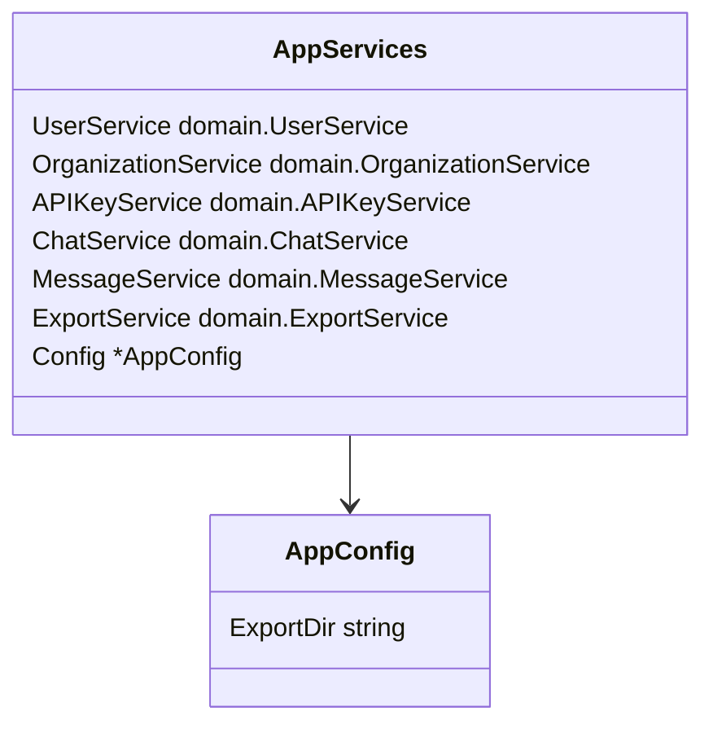

# [services.go](services.go)

Package `api` implements the REST API router and routes for the ChatLogger API.

This file defines the `AppServices` and `AppConfig` structures used for dependency injection throughout the application. It centralizes all service dependencies in one place making them available to handlers and middleware.



```go
package api

import "github.com/kjanat/chatlogger-api-go/internal/domain"

// AppConfig contains application configuration values
type AppConfig struct {
    ExportDir string
}

// AppServices contains all the services used by the application.
type AppServices struct {
    UserService         domain.UserService
    OrganizationService domain.OrganizationService
    APIKeyService       domain.APIKeyService
    ChatService         domain.ChatService
    MessageService      domain.MessageService
    ExportService       domain.ExportService
    Config              *AppConfig
}
```
