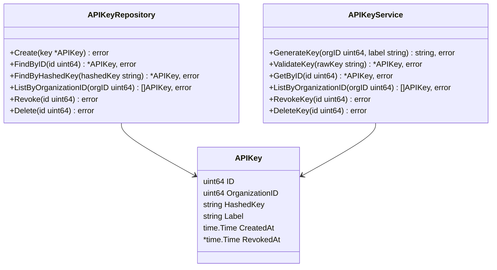
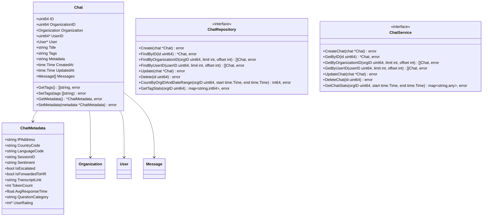
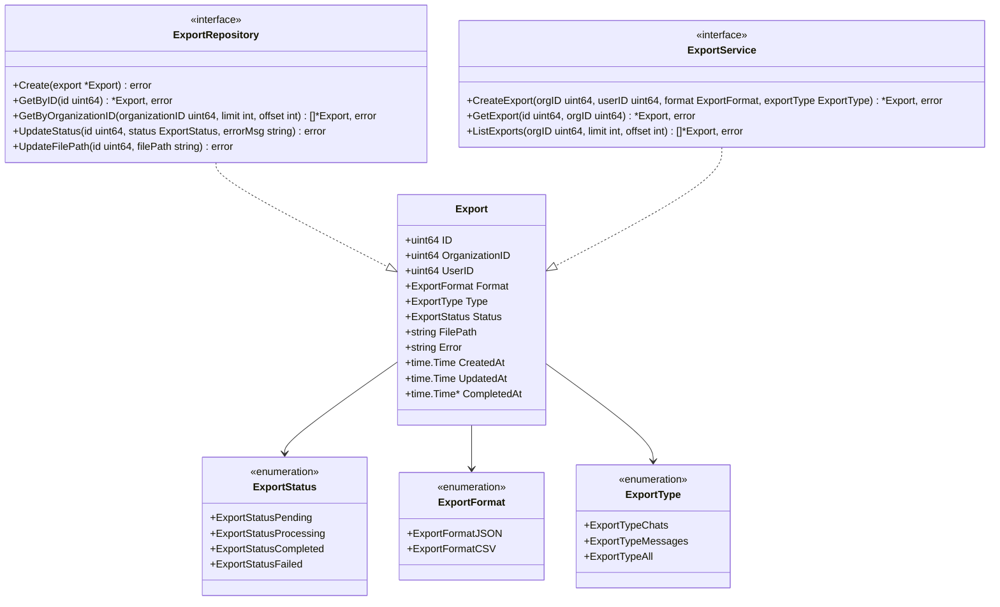

# domain

Package `domain` defines the core business entities, interfaces and types that represent the application's domain model for the ChatLogger API.

It contains domain entities, service interfaces, and repository interfaces.

## [apikey.go](apikey.go)



```go
import "time"

// APIKey represents authentication credentials for organization API access.
type APIKey struct {
    ID             uint64     `gorm:"primaryKey"                    json:"id"`
    OrganizationID uint64     `gorm:"not null"                      json:"organization_id"`
    HashedKey      string     `gorm:"size:255;uniqueIndex;not null" json:"-"` // Hashed, never return raw
    Label          string     `gorm:"size:100;not null"             json:"label"`
    CreatedAt      time.Time  `                                     json:"created_at"`
    RevokedAt      *time.Time `                                     json:"revoked_at,omitempty"`
}

// APIKeyRepository defines the interface for API key data operations.
type APIKeyRepository interface {
    Create(key *APIKey) error
    FindByID(id uint64) (*APIKey, error)
    FindByHashedKey(hashedKey string) (*APIKey, error)
    ListByOrganizationID(orgID uint64) ([]APIKey, error)
    Revoke(id uint64) error
    Delete(id uint64) error
}

// APIKeyService defines the interface for API key business logic.
type APIKeyService interface {
    GenerateKey(orgID uint64, label string) (string, error) // Returns the raw key (only shown once)
    ValidateKey(rawKey string) (*APIKey, error)
    GetByID(id uint64) (*APIKey, error)
    ListByOrganizationID(orgID uint64) ([]APIKey, error)
    RevokeKey(id uint64) error
    DeleteKey(id uint64) error
}
```

## [chat.go](chat.go)



```go
import (
    "encoding/json"
    "time"
)

// ChatMetadata represents extended information about a chat session.
type ChatMetadata struct {
    IPAddress        string  `json:"ip_address,omitempty"`
    CountryCode      string  `json:"country_code,omitempty"`  // ISO-3166 country code (e.g., "NL")
    LanguageCode     string  `json:"language_code,omitempty"` // ISO-639 language code (e.g., "tr")
    SessionID        string  `json:"session_id,omitempty"`
    Sentiment        string  `json:"sentiment,omitempty"`
    IsEscalated      bool    `json:"is_escalated,omitempty"`
    IsForwardedToHR  bool    `json:"is_forwarded_to_hr,omitempty"`
    TranscriptLink   string  `json:"transcript_link,omitempty"`
    TokenCount       int     `json:"token_count,omitempty"`       // Total tokens for the chat session
    AvgResponseTime  float64 `json:"avg_response_time,omitempty"` // In seconds
    QuestionCategory string  `json:"question_category,omitempty"`
    UserRating       *int    `json:"user_rating,omitempty"` // Optional user rating
}

// Chat represents a conversation session.
type Chat struct {
    ID             uint64       `gorm:"primaryKey"                json:"id"`
    OrganizationID uint64       `gorm:"not null;index"            json:"organization_id"`
    Organization   Organization `gorm:"foreignKey:OrganizationID" json:"-"`
    UserID         *uint64      `                                 json:"user_id,omitempty"` // Nullable for anonymous chats
    User           *User        `gorm:"foreignKey:UserID"         json:"-"`
    Title          string       `gorm:"size:255"                  json:"title"`
    Tags           string       `gorm:"type:jsonb"                json:"tags"`     // JSON array of tags as string
    Metadata       string       `gorm:"type:jsonb"                json:"metadata"` // Store ChatMetadata as JSON string
    CreatedAt      time.Time    `                                 json:"created_at"`
    UpdatedAt      time.Time    `                                 json:"updated_at"`
    Messages       []Message    `gorm:"foreignKey:ChatID"         json:"messages,omitempty"`
}

// GetTags parses the JSON tags string into a slice.
func (c *Chat) GetTags() ([]string, error) {
    var tags []string
    if c.Tags == "" || c.Tags == "null" {
        return []string{}, nil
    }
    err := json.Unmarshal([]byte(c.Tags), &tags)
    return tags, err
}

// SetTags converts a slice of tags into a JSON string.
func (c *Chat) SetTags(tags []string) error {
    if tags == nil {
        tags = []string{} // Ensure empty array instead of null
    }
    tagsJSON, err := json.Marshal(tags)
    if err != nil {
        return err
    }
    c.Tags = string(tagsJSON)
    return nil
}

// GetMetadata parses the JSON metadata string into the ChatMetadata struct.
func (c *Chat) GetMetadata() (*ChatMetadata, error) {
    var metadata ChatMetadata
    if c.Metadata == "" || c.Metadata == "null" {
        return &metadata, nil // Return empty struct if no metadata
    }
    err := json.Unmarshal([]byte(c.Metadata), &metadata)
    return &metadata, err
}

// SetMetadata converts the ChatMetadata struct into a JSON string.
func (c *Chat) SetMetadata(metadata *ChatMetadata) error {
    if metadata == nil {
        c.Metadata = "{}" // Store empty JSON object if nil
        return nil
    }
    metadataJSON, err := json.Marshal(metadata)
    if err != nil {
        return err
    }
    c.Metadata = string(metadataJSON)
    return nil
}

// ChatRepository defines the interface for chat data operations.
type ChatRepository interface {
    Create(chat *Chat) error
    FindByID(id uint64) (*Chat, error)
    FindByOrganizationID(orgID uint64, limit, offset int) ([]Chat, error)
    FindByUserID(userID uint64, limit, offset int) ([]Chat, error)
    Update(chat *Chat) error
    Delete(id uint64) error
    CountByOrgIDAndDateRange(orgID uint64, start, end time.Time) (int64, error)
    GetTagStats(orgID uint64) (map[string]int64, error)
}

// ChatService defines the interface for chat business logic.
type ChatService interface {
    CreateChat(chat *Chat) error
    GetByID(id uint64) (*Chat, error)
    GetByOrganizationID(orgID uint64, limit, offset int) ([]Chat, error)
    GetByUserID(userID uint64, limit, offset int) ([]Chat, error)
    UpdateChat(chat *Chat) error
    DeleteChat(id uint64) error
    GetChatStats(orgID uint64, start, end time.Time) (map[string]any, error)
}
```

## [export.go](export.go)



```go
import "time"

// ExportStatus represents the current status of an export job
type ExportStatus string

const (
    ExportStatusPending    ExportStatus = "pending"
    ExportStatusProcessing ExportStatus = "processing"
    ExportStatusCompleted  ExportStatus = "completed"
    ExportStatusFailed     ExportStatus = "failed"
)

// ExportFormat represents the format of an export
type ExportFormat string

const (
    ExportFormatJSON ExportFormat = "json"
    ExportFormatCSV  ExportFormat = "csv"
)

// ExportType represents the type of data being exported
type ExportType string

const (
    ExportTypeChats    ExportType = "chats"
    ExportTypeMessages ExportType = "messages"
    ExportTypeAll      ExportType = "all"
)

// Export represents an asynchronous export job
type Export struct {
    ID             uint64       `json:"id" gorm:"primaryKey"`
    OrganizationID uint64       `json:"organization_id"`
    UserID         uint64       `json:"user_id"`
    Format         ExportFormat `json:"format"`
    Type           ExportType   `json:"type"`
    Status         ExportStatus `json:"status"`
    FilePath       string       `json:"file_path,omitempty"`
    Error          string       `json:"error,omitempty"`
    CreatedAt      time.Time    `json:"created_at"`
    UpdatedAt      time.Time    `json:"updated_at"`
    CompletedAt    *time.Time   `json:"completed_at,omitempty"`
}

// ExportRepository defines the operations available on exports
type ExportRepository interface {
    Create(export *Export) error
    GetByID(id uint64) (*Export, error)
    GetByOrganizationID(organizationID uint64, limit, offset int) ([]*Export, error)
    UpdateStatus(id uint64, status ExportStatus, errorMsg string) error
    UpdateFilePath(id uint64, filePath string) error
}

// ExportService defines the interface for export-related business logic
type ExportService interface {
    CreateExport(orgID, userID uint64, format ExportFormat, exportType ExportType) (*Export, error)
    GetExport(id, orgID uint64) (*Export, error)
    ListExports(orgID uint64, limit, offset int) ([]*Export, error)
}
```

## [message.go](message.go)


```go
import (
    "encoding/json"
    "errors"
    "time"
)

// MessageRole represents the role of the message sender.
type MessageRole string

// Message role constants define the possible roles for a chat message.
const (
    // MessageRoleUser represents a message sent by the user/client.
    MessageRoleUser MessageRole = "user"
    // MessageRoleAssistant represents a message generated by the AI assistant.
    MessageRoleAssistant MessageRole = "assistant"
    // MessageRoleSystem represents a system message providing context or instructions.
    MessageRoleSystem MessageRole = "system"
)

// IsValid checks if the message role is valid.
func (r MessageRole) IsValid() bool {
    switch r {
    case MessageRoleUser, MessageRoleAssistant, MessageRoleSystem:
        return true
    }

    return false
}

// MessageMetadata represents extended information about a message.
type MessageMetadata struct {
    TokenCount   int     `json:"token_count,omitempty"`
    ResponseTime float64 `json:"response_time,omitempty"` // In milliseconds
    // Add other message-specific metadata fields here if needed
}

// Message represents a single message in a chat.
type Message struct {
    ID        uint64      `gorm:"primaryKey"         json:"id"`
    ChatID    uint64      `gorm:"not null"           json:"chat_id"`
    Role      MessageRole `gorm:"size:20;not null"   json:"role"`
    Content   string      `gorm:"type:text;not null" json:"content"`
    Metadata  string      `gorm:"type:jsonb"         json:"metadata"` // Store MessageMetadata as JSON string
    CreatedAt time.Time   `                          json:"created_at"`
}

// GetMetadata parses the JSON metadata string into the MessageMetadata struct.
func (m *Message) GetMetadata() (*MessageMetadata, error) {
    var metadata MessageMetadata
    if m.Metadata == "" || m.Metadata == "null" {
        return &metadata, nil // Return empty struct if no metadata
    }
    err := json.Unmarshal([]byte(m.Metadata), &metadata)
    return &metadata, err
}

// SetMetadata converts the MessageMetadata struct into a JSON string.
func (m *Message) SetMetadata(metadata *MessageMetadata) error {
    if metadata == nil {
        m.Metadata = "{}" // Store empty JSON object if nil
        return nil
    }
    metadataJSON, err := json.Marshal(metadata)
    if err != nil {
        return err
    }
    m.Metadata = string(metadataJSON)
    return nil
}

// Validate performs validation on the message structure.
func (m *Message) Validate() error {
    if !m.Role.IsValid() {
        return errors.New("invalid message role, must be 'user', 'assistant', or 'system'")
    }

    if m.Content == "" {
        return errors.New("message content cannot be empty")

    }

    return nil
}

// MessageRepository defines the interface for message data operations.
type MessageRepository interface {
    Create(message *Message) error
    FindByID(id uint64) (*Message, error)
    FindByChatID(chatID uint64) ([]Message, error)
    CountByOrgIDAndDateRange(orgID uint64, start, end time.Time) (int64, error)
    GetRoleStats(orgID uint64) (map[MessageRole]int64, error)
    // Remove or update methods related to deprecated fields if they exist
    // GetLatencyStats(orgID uint64) (map[string]float64, error)  // min, max, avg
    // GetTokenCountStats(orgID uint64) (map[string]int64, error) // total, avg
}

// MessageService defines the interface for message business logic.
type MessageService interface {
    CreateMessage(message *Message) error
    GetByID(id uint64) (*Message, error)
    GetByChatID(chatID uint64) ([]Message, error)
    // Analytics methods for messages
    GetMessageStats(orgID uint64, start, end time.Time) (map[string]interface{}, error)
}
```

## [organization.go](organization.go)


```go
import "time"

// Organization represents a tenant in the multi-tenant system.
type Organization struct {
    ID        uint64    `gorm:"primaryKey"                                json:"id"`
    Name      string    `gorm:"size:100;not null"                         json:"name"`
    Slug      string    `gorm:"size:50;uniqueIndex:idx_org_slug;not null" json:"slug"`
    Settings  string    `gorm:"type:jsonb"                                json:"settings"`
    CreatedAt time.Time `                                                 json:"created_at"`
    UpdatedAt time.Time `                                                 json:"updated_at"`
    APIKeys   []APIKey  `gorm:"foreignKey:OrganizationID"                 json:"-"`
    Users     []User    `gorm:"foreignKey:OrganizationID"                 json:"-"`
    Chats     []Chat    `gorm:"foreignKey:OrganizationID"                 json:"-"`
}

// OrganizationRepository defines the interface for organization data operations.
type OrganizationRepository interface {
    Create(org *Organization) error
    FindByID(id uint64) (*Organization, error)
    FindBySlug(slug string) (*Organization, error)
    Update(org *Organization) error
    Delete(id uint64) error
    List(limit, offset int) ([]Organization, error)
}

// OrganizationService defines the interface for organization business logic.
type OrganizationService interface {
    Create(org *Organization) error
    GetByID(id uint64) (*Organization, error)
    GetBySlug(slug string) (*Organization, error)
    Update(org *Organization) error
    Delete(id uint64) error
    List(limit, offset int) ([]Organization, error)
}
```

## [user.go](user.go)

```go
import "time"

// Role represents user permission levels.
type Role string

const (
    RoleSuperAdmin Role = "superadmin" // Can manage all orgs
    RoleAdmin      Role = "admin"      // Can manage own org
    RoleUser       Role = "user"       // Regular user
    RoleViewer     Role = "viewer"     // Read-only user
)

// User represents a registered user in the system.
type User struct {
    ID             uint64       `gorm:"primaryKey"                json:"id"`
    OrganizationID uint64       `gorm:"not null;index"            json:"organization_id"`
    Organization   Organization `gorm:"foreignKey:OrganizationID" json:"-"`
    Email          string       `gorm:"size:255;uniqueIndex"      json:"email"`
    PasswordHash   string       `gorm:"size:255"                  json:"-"`
    Role           Role         `gorm:"size:50;not null"          json:"role"`
    FirstName      string       `gorm:"size:100"                  json:"first_name"`
    LastName       string       `gorm:"size:100"                  json:"last_name"`
    CreatedAt      time.Time    `                                 json:"created_at"`
    UpdatedAt      time.Time    `                                 json:"updated_at"`
    LastLoginAt    *time.Time   `                                 json:"last_login_at,omitempty"`
    Chats          []Chat       `gorm:"foreignKey:UserID"         json:"-"`
}

// UserRepository defines the interface for user data operations.
type UserRepository interface {
    Create(user *User) error
    FindByID(id uint64) (*User, error)
    FindByEmail(email string) (*User, error)
    FindByOrganizationID(orgID uint64, limit, offset int) ([]User, error)
    Update(user *User) error
    Delete(id uint64) error
}

// UserService defines the interface for user business logic.
type UserService interface {
    Authenticate(email, password string) (*User, string, error) // Returns user, JWT token, error
    Register(user *User, password string) error
    GetByID(id uint64) (*User, error)
    GetByEmail(email string) (*User, error)
    GetByOrganizationID(orgID uint64, limit, offset int) ([]User, error)
    UpdateUser(user *User) error
    ChangePassword(userID uint64, currentPassword, newPassword string) error
    DeleteUser(id uint64) error
}
```
